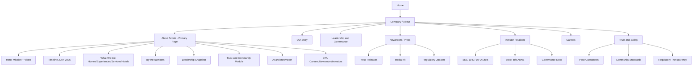

# Airbnb Company Introduction Page — Web Design Proposal

Prepared: 2026-08-18
Based on: `research/airbnb/airbnb_research.txt` (verified-source company research)
Scope note: This is a design-practice exercise. It proposes a redesigned "Company / About Us" page built around publicly researched Airbnb facts — it is not an implementation for the real airbnb.com site.

---

## 1. Project Overview

### 1.1 Purpose
Design a "Company Introduction" (About Us / Corporate) page that communicates who Airbnb is, what it does, and why it matters — to investors, prospective hosts/guests, job seekers, and press — using only verified facts from the research file (SEC filings, official IR pages, and reputable press: Reuters-tier outlets, Forbes, CNBC, NPR, Fortune, The Motley Fool, etc.).

### 1.2 Background
Airbnb has evolved from a two-person air-mattress rental idea (2007–2008) into a NASDAQ-listed (ABNB) global marketplace spanning Homes, Experiences, Services, and an expanding Hotels/Originals offering. The 2025 relaunch of Experiences and the new Services vertical, plus 2026 AI-native positioning and large-event partnerships (World Cup, Olympics), give the company a distinct "beyond bookings" narrative worth featuring on a company page.

### 1.3 Scope
- One primary page: `/about` (Company / About Us)
- Supporting subpages: Our Story, Leadership, Newsroom/Press, Careers landing, Investor Relations landing, Trust & Safety, Diversity & Belonging
- Desktop, tablet, and mobile responsive layouts
- Out of scope: booking/search flow, host onboarding flow, payment systems

---

## 2. Target User Analysis

### Persona 1 — "Prospective Host, Maria (42)"
- Owns a second property, considering listing it on Airbnb vs. a competitor.
- Visits the About page to judge company trustworthiness, financial stability, and community values before committing her property.
- Needs: proof of scale (host/guest numbers), safety/trust messaging, clear company story, transparent business model.

### Persona 2 — "Financial Journalist / Analyst, David (35)"
- Covers travel-tech earnings; needs quick access to leadership bios, IR links, latest quarterly highlights, and regulatory context (e.g., Spain fine, LA short-term-rental debate).
- Needs: fast navigation to Newsroom and Investor Relations, dated facts with sources, no marketing fluff burying numbers.

### Persona 3 (secondary) — "Prospective Employee, Priya (27)"
- Evaluating Airbnb as an employer; cares about mission, culture, AI-forward engineering practices ("founder mode"), and career page entry point.

---

## 3. Benchmark / Reference Site Analysis

Reference pages were selected from companies frequently cited as strong "About Us" examples, cross-checked against two independent design-review sources: Webstacks' B2B/SaaS roundup and Shopify's About Us page guide.

| Reference | Layout / Navigation | Visual Style | Storytelling Approach | Relevance to Airbnb |
|---|---|---|---|---|
| **Notion** | Narrative-driven flow moving from founding history to present-day mission | Friendly custom illustration style; consistent brand-defining visuals | Traces the history of workplace tools, then states mission ("shape the tools that shape their lives") | Strong model for a chronological "Our Story" section that turns Airbnb's 2007–2026 timeline into a readable narrative rather than a bare list |
| **HubSpot** | Mission statement first, then team/office photography, then global statistics, then locations/contact | On-brand city/office graphics; collaborative team photos | Founders' MIT origin story (2004–2006) leading into inbound-marketing category creation; heavy use of scale numbers (employees, customers) | Good model for the "By the Numbers" stat band (hosts, guests, countries, cities) and for pairing mission copy with credibility metrics |
| **Airtable** | Clean, well-organized sections with generous whitespace; product visuals interleaved with copy | Ample whitespace; clear section separation; minimal color accents | Frames the company around empowering users to "create apps and manage workflows" | Model for a calm, uncluttered layout that keeps a data-heavy company (financials, host stats) from feeling cramped |
| **YETI** | Looping background video in hero; team/community photography; clickable partner/community stories | Imagery and video communicate brand values immediately, minimal reliance on text | Founder story told through lived experience and community sponsorships | Model for the hero section: a looping video of real homes/hosts instead of static stock imagery, reinforcing "belong anywhere" |
| **Mailchimp** | Founder story with credentials, followed by a distinct "corporate citizenship" / community section | Warm, candid team photography (e.g., team on a couch) | Emphasizes small-business commitment and community initiatives alongside company history | Model for a dedicated "Community & Trust" module — relevant given Airbnb's host-community identity and ongoing regulatory/trust conversations |

**Cross-cutting takeaways applied to this proposal:**
1. Lead with mission/story before financial credibility numbers (Notion, HubSpot pattern).
2. Use a numbers band for scale/credibility, clearly labeled with data vintage and source (HubSpot pattern) — critical here since several Airbnb scale metrics in the research are marked "reference only, unconfirmed via primary source."
3. Keep layout airy with strong whitespace so dense verified data (financials, regulatory notes) doesn't read as a wall of text (Airtable pattern).
4. Use video/motion in the hero to convey "belonging" emotionally rather than only through copy (YETI pattern).
5. Give community/trust its own section rather than burying it in the footer (Mailchimp pattern) — appropriate given Airbnb's Trust & Safety emphasis and recent regulatory news (Spain, LA).

**Sources (3.1):**
- Webstacks, "16 Best About Us Page Examples in B2B & SaaS" — https://www.webstacks.com/blog/about-us-page
- Shopify, "16 Great About Us Page Examples That Drive Results" — https://www.shopify.com/blog/how-to-write-an-about-us-page

### 3.2 Regional Benchmark: GDWEB (Korea) Award Selections

GDWEB (gdweb.co.kr) is a long-running Korean web design awards/gallery site (operating since 2005) used here as a second, regionally-grounded benchmark set, searched directly for travel/community-adjacent selections and one high-impact brand-story example.

| Reference | Live URL | GDWEB Selection Page | Design Concept Tag | Relevance to Airbnb |
|---|---|---|---|---|
| **여행이지 (Travel Ease)** | https://www.kyowontour.com/ | https://www.gdweb.co.kr/sub/view.asp?str_no=17118 | "안정적" (Stable/Reliable) | Photography-led travel-agency layout built around reliability — a direct-industry model for a trust-first hero and booking-adjacent credibility cues |
| **일상과 여행 사이 (Between Daily Life and Travel)** | http://ilsangtrip.com | https://www.gdweb.co.kr/sub/view.asp?str_no=18486 | "모던한" (Modern) | Green/orange/pink/white palette, content-first (photo + illustration) treatment of everyday travel — matches the "local discovery / belonging" tone this proposal targets |
| **지구촌 스마트여행 (Global Smart Travel)** | http://www.smartoutbound.or.kr | https://www.gdweb.co.kr/sub/view.asp?str_no=7180 | "심플한" (Simple) | White-based, clearly categorized top navigation and information grouping — a direct reference for the clean IA-to-layout mapping in Section 4 |
| **토스 브랜드 스토리 (Toss Brand Story)** | https://toss.im/new-dimension/brand-story | https://www.gdweb.co.kr/sub/view.asp?Txt_fgbn=5&str_no=22139 | "역동적/첨단적" (Dynamic/Advanced) | Different industry (fintech) but a GDWEB GRAND PRIZE winner; its single-page, immersive brand-narrative structure is the strongest available model for how the "Our Story" scroll narrative should feel |
| **Tashi** | https://tashi.design/ | https://www.gdweb.co.kr/sub/view.asp?Txt_fgbn=23&str_no=26932 | "서정적인" (Lyrical/Poetic) | Illustration-led, green-toned, unhurried storytelling — a tonal reference for conveying brand values without heavy text or hard-sell copy |

**Why included alongside 3.1:** the Webstacks/Shopify set (3.1) covers global B2B/SaaS "About Us" conventions; this GDWEB set adds (a) two direct travel/tourism-industry layouts, (b) one info-architecture-forward example, and (c) two brand-storytelling examples with a warmer, more editorial register closer to Airbnb's target mood (Section 5). Only listings with a verifiable live URL and a GDWEB selection record were included; entries with unregistered/unverifiable production or source data were excluded.

**Sources (3.2):** GDWEB (지디웹), selection pages linked in the table above — https://www.gdweb.co.kr/

---

## 4. Information Architecture (Sitemap)

### 4.1 Text Tree

```
Home
└── Company (GNB entry: "About")
    ├── About Airbnb (primary page — this proposal)
    │   ├── Hero: Mission statement + video
    │   ├── Our Story (2007–2026 timeline)
    │   ├── What We Do (Homes / Experiences / Services / Hotels & Originals)
    │   ├── By the Numbers (hosts, guests, countries — sourced & dated)
    │   ├── Leadership (Brian Chesky – CEO, Ellie Mertz – CFO)
    │   ├── Trust, Safety & Community
    │   ├── Innovation & AI (2026 AI-native strategy, "founder mode")
    │   └── CTA band → Careers / Newsroom / Investors
    ├── Our Story (deep-dive subpage, linked from timeline "Read more")
    ├── Leadership & Governance
    │   └── Executive bios (Chesky, Mertz; board notes)
    ├── Newsroom / Press
    │   ├── Press releases
    │   ├── Media kit
    │   └── Regulatory & policy updates (Spain, LA, etc.)
    ├── Investor Relations
    │   ├── Quarterly results (links to SEC 10-K/10-Q, earnings calls)
    │   ├── Stock info (ABNB, NASDAQ)
    │   └── Governance documents
    ├── Careers
    │   ├── Culture & "founder mode"
    │   ├── Open roles
    │   └── Life at Airbnb
    └── Trust & Safety
        ├── Host guarantees
        ├── Community standards
        └── Regulatory transparency (unlicensed-listing enforcement, host verification)
```

### 4.2 Mermaid Diagram



### 4.3 GNB (Global Navigation Bar) Structure

`Logo | Homes | Experiences | Services | Company ▾ (About · Newsroom · Careers · Investors) | Help | [Language/Currency] | Log in / Sign up`

---

## 5. Design Concept

### 5.1 Concept Keywords
**"Belong, Verified."** — Three keyword pillars derived directly from the research:
1. **Trust** — Airbnb's business is built on strangers trusting each other; the research shows heavy recent attention to regulatory/trust issues (Spain fine, LA debate), making transparency a design priority, not just a value statement.
2. **Belonging / Community** — Core brand DNA (host–guest relationship, community-driven Experiences/Services); should be expressed through real human imagery over stock photography.
3. **Local Discovery** — Experiences/Services expansion (chefs, tours, local activities) signals a shift from "a place to stay" to "a way to experience a place"; the design should reflect locality and texture, not generic travel-brand gloss.

### 5.2 Mood Direction
- Warm, human, editorial — closer to a travel magazine than a corporate SaaS site.
- Photography-led: real hosts and guests, real neighborhoods, natural light, minimal staging.
- Confident but calm data presentation for the financial/investor-facing sections (contrast with the warm consumer-facing sections) — two registers within one consistent system.

### 5.3 Tone & Manner
- Voice: optimistic, plainspoken, community-first; avoid corporate jargon.
- Visual rhythm: alternate warm lifestyle sections with clean, neutral data sections (numbers band, financial highlights) so credibility and warmth don't compete.
- Motion: subtle, purposeful (looping hero video, gentle scroll-triggered fades) — never distracting from content.

---

## 6. Color Palette & Typography

### 6.1 Color Palette

| Role | Color | Hex | Notes |
|---|---|---|---|
| Primary brand accent | Rausch (Airbnb-style coral-red) | `#FF385C` | Used sparingly for CTAs and key highlights only |
| Secondary accent | Deep teal | `#00A699` | Trust/verification badges, links |
| Neutral dark (text) | Charcoal | `#222222` | Body copy, headings |
| Neutral mid (secondary text) | Warm gray | `#717171` | Captions, metadata, source citations |
| Neutral light (background) | Off-white | `#F7F7F7` | Section backgrounds, alternating with white |
| Base background | Pure white | `#FFFFFF` | Primary background |
| Data/finance section accent | Slate blue | `#3E4C59` | Distinguishes IR/financial modules from lifestyle sections |
| Alert/regulatory note | Muted amber | `#B7791F` | Used only for flagged/unverified-data callouts, matching the research file's "uncertain information" convention |

### 6.2 Typography

| Use | Typeface (web-safe stack) | Notes |
|---|---|---|
| Display / Hero headlines | "Cereal"-style rounded sans fallback: `"Circular Std", "Poppins", "Segoe UI", sans-serif` | Large, confident, friendly weight (600–700) |
| Body copy | `"Inter", "Helvetica Neue", Arial, sans-serif` | High legibility at small sizes; used for all long-form and data text |
| Data/financial tables | `"Inter", "Roboto Mono" for numerals, monospace fallback` | Monospaced numerals improve scanability of financial figures |
| Captions / source citations | `"Inter", sans-serif`, 12–13px, warm gray `#717171` | Matches the research file's practice of always citing source + date |

---

## 7. Page-by-Page Wireframe Overview

### 7.1 About Airbnb (Primary Page)
1. **Hero** — Full-bleed looping video/photo of real hosts and guests; headline mission statement; scroll-cue.
2. **Our Story (condensed timeline)** — Horizontal or vertical timeline: 2007 idea → 2008 launch → 2009 Y Combinator/seed → 2020 IPO → 2025 Experiences/Services relaunch → 2026 AI & events strategy. Each entry shows year, one-line fact, and a small source tag (e.g., "Britannica Money"). "Read full story →" link to Our Story subpage.
3. **What We Do** — Four-card grid: Homes, Experiences, Services, Hotels & Originals, each with one-sentence description drawn from the research's business-model section.
4. **By the Numbers** — Stat band (5 stats max) with explicit "as of [date], source: [outlet]" microcopy beneath each number, honoring the research's flagged-data caveats (e.g., host count sourced via cached newsroom snippet, not directly verified).
5. **Leadership** — Two-up card: Brian Chesky (CEO & co-founder) and Ellie Mertz (CFO), photo, title, one-line bio, link to full Leadership page.
6. **Trust, Safety & Community** — Three-column module: Host Guarantees, Community Standards, Regulatory Transparency (with a neutral, factual mention that Airbnb has engaged with regulators in markets such as Spain and Los Angeles).
7. **Innovation & AI** — Short module referencing 2026 AI-native strategy and "founder mode," sourced to Fortune/Motley Fool.
8. **Closing CTA band** — Three links: Careers, Newsroom, Investor Relations.

### 7.2 Our Story (subpage)
- Full chronological deep-dive timeline (all dated facts from research section 2), each entry with source citation, expandable detail on request.

### 7.3 Leadership & Governance (subpage)
- Full bios for Chesky and Mertz; note that co-founders' current formal titles are marked "unconfirmed" per research and therefore omitted rather than guessed.

### 7.4 Newsroom / Press (subpage)
- Press release list, media kit download, dedicated "Regulatory & Policy Updates" feed (Spain fine, LA short-term-rental debate) — each entry timestamped and sourced.

### 7.5 Investor Relations (subpage)
- Stock snapshot (ABNB, NASDAQ) with an explicit disclaimer that market-cap figures vary by data provider (per research section 7.2) and a "last updated" timestamp; direct links to SEC 10-K/10-Q filings and earnings-call transcripts.

---

## 8. Responsive / Device Strategy

- **Breakpoints:** Mobile (< 480px), Large mobile (480–767px), Tablet (768–1023px), Desktop (1024–1439px), Large desktop (≥ 1440px).
- **Hero video:** Autoplay muted looping video on desktop/tablet with Wi-Fi; falls back to a static hero image on mobile/cellular to control data usage.
- **Timeline:** Horizontal scroll-snap timeline on desktop; collapses to a vertical stacked timeline on mobile.
- **Stat band:** 4–5 column grid on desktop → 2-column grid on tablet → single-column stacked cards on mobile.
- **GNB:** Full horizontal menu with "Company" dropdown on desktop/tablet; collapses into a hamburger menu on mobile, with "Company" as an expandable accordion section.
- **Data tables (IR section):** Horizontally scrollable card/table hybrid on mobile rather than shrinking font size.
- **Touch targets:** Minimum 44×44px for all interactive elements on mobile per standard accessibility guidance.

---

## 9. Content Strategy

### 9.1 Copy Tone
- Plainspoken, warm, first-person-plural ("we") voice for lifestyle/story sections; neutral, precise, third-person voice for IR/Newsroom/regulatory sections.
- Every statistic or dated claim carries a visible source + date, mirroring the sourcing discipline already established in the research file — this is a differentiator versus typical corporate About pages that state numbers without attribution.
- Avoid absolute superlatives not backed by the research (e.g., do not claim "the world's largest" without a verifiable citation); where the research marks a figure as unconfirmed (e.g., 44% market share, exact host counts), the page must either omit it or clearly label it "estimate, unconfirmed."

### 9.2 Imagery Direction
- Real, candid photography of hosts/guests/neighborhoods over staged studio photography; diverse geographies and living situations to reflect the "belong anywhere" pillar.
- Avoid generic luxury-travel stock imagery; favor everyday, textured, local scenes (a kitchen, a stoop, a neighborhood street) consistent with the Experiences/Services expansion narrative.
- Leadership photography: natural, approachable environmental portraits rather than stiff corporate headshots.

---

## 10. Development & Timeline Plan (High-Level Milestones)

| Phase | Duration (approx.) | Deliverables |
|---|---|---|
| 1. Discovery & Content Audit | Week 1 | Finalize verified content inventory (based on research file), confirm sourcing/citation requirements with legal/comms |
| 2. IA & Wireframes | Weeks 2–3 | Sitemap sign-off, low-fidelity wireframes for all 6 pages, responsive breakpoint plan |
| 3. Visual Design | Weeks 4–5 | Mood board, color/type system, high-fidelity comps for About page + 1 subpage, design review |
| 4. Full Page Design | Weeks 6–7 | High-fidelity comps for remaining subpages (Our Story, Leadership, Newsroom, IR, Trust & Safety) |
| 5. Prototyping & Usability Check | Week 8 | Clickable prototype, informal usability walkthroughs against the two personas |
| 6. Handoff & Dev Build | Weeks 9–12 | Design specs/assets handoff, front-end build, responsive QA |
| 7. Content QA & Launch | Week 13 | Final source-citation audit (cross-check every stat against research file section 7's caveats), accessibility check, launch |

---

## 11. References & Sources

### 11.1 Company Facts
All company facts referenced in this proposal are drawn from `research/airbnb/airbnb_research.txt`, which itself cites primary/verified sources including:
- SEC EDGAR — Airbnb, Inc. Form 10-K (FY2024, FY2025), Form 10-Q (FY2026 Q1)
- Britannica Money — "Airbnb | History, Business Model, & Impact"
- The Motley Fool — Airbnb Q2 2026 Earnings Call Transcript (2026-08-13)
- Fortune — "Airbnb CEO Brian Chesky..." (2026-08-14)
- Forbes, CNBC, CBS News, NPR — 2020 layoff coverage
- Hotel-Online, Planetizen, ShortTermRentalz, PhocusWire — Spain regulatory fine coverage (Dec 2025)
- LAist — LA short-term rental regulation coverage
- CFO Dive, Netflix IR — Ellie Mertz board appointment
- Skift — short-term rental market share estimate (flagged as single-source, reference only)

Figures marked "unconfirmed" or "reference only" in the research file (e.g., exact host/listing counts sourced via blocked newsroom page, market-cap variance across data providers, market-share estimate, June 2026 layoff rumor) are treated the same way in this design proposal: either omitted from primary display copy or explicitly labeled as estimates.

### 11.2 Design Reference Sources
- Webstacks, "16 Best About Us Page Examples in B2B & SaaS" — https://www.webstacks.com/blog/about-us-page
- Shopify, "16 Great About Us Page Examples That Drive Results (2026)" — https://www.shopify.com/blog/how-to-write-an-about-us-page
- GDWEB (지디웹), "여행이지" selection — https://www.gdweb.co.kr/sub/view.asp?str_no=17118 (live: https://www.kyowontour.com/)
- GDWEB (지디웹), "일상과 여행 사이" selection — https://www.gdweb.co.kr/sub/view.asp?str_no=18486 (live: http://ilsangtrip.com)
- GDWEB (지디웹), "지구촌 스마트여행" selection — https://www.gdweb.co.kr/sub/view.asp?str_no=7180 (live: http://www.smartoutbound.or.kr)
- GDWEB (지디웹), "토스 브랜드 스토리" selection — https://www.gdweb.co.kr/sub/view.asp?Txt_fgbn=5&str_no=22139 (live: https://toss.im/new-dimension/brand-story)
- GDWEB (지디웹), "Tashi" selection — https://www.gdweb.co.kr/sub/view.asp?Txt_fgbn=23&str_no=26932 (live: https://tashi.design/)
