# Helinox Company Introduction Page — Web Design Proposal

Prepared: 2026-08-20
Based on: `research/helinox/helinox_research.txt` (Helinox brand research, prepared by the "조사관" research agent)
Scope note: This proposal is a design exercise built from the cited research file. It proposes a redesigned "Company / About Us" page for the Helinox brand; it is not an implementation for the real helinox.com or helinox.co.kr sites. This document is written to be implementation-ready for a follow-on "Web Designer" agent to build as a static HTML/CSS/JS site.

---

## 1. Project Overview

### 1.1 Purpose
Design a "Company Introduction / About Us" page that communicates who Helinox is, what makes its engineering distinctive, and why it matters — to prospective retail/wholesale partners, design-conscious outdoor consumers, and industry press/analysts — using only facts confirmed in the research file. Where the research file flags a figure as uncertain, single-sourced, or conflicting across outlets (founding year, exact Chair One weight, 2022 revenue, headquarters definition, official brand colors, patent details, the Snow Peak collaboration), this proposal carries that same caveat forward rather than presenting it as settled fact.

### 1.2 Background
Helinox began as a consumer-brand offshoot of DAC (Dong-A Aluminum), the world's leading tent-pole OEM manufacturer (a ~90% share of the premium tent-pole market, supplying brands such as The North Face, MSR, Big Agnes, and Hilleberg). Helinox's 2012 Chair One took DAC's three decades of ultralight, high-strength aluminum-pole engineering and turned it into a category-defining piece of outdoor furniture — inaugurating an "ultralight outdoor furniture" category that did not exist before. The brand has since expanded into Cot, Table, Tent/Tarp, and (most recently) Wear product lines, accumulated 18 Red Dot Design Award wins by 2026 (including the first-ever Wear-category win by a Korean outdoor brand), and built a fashion/street-culture collaboration history (Supreme, Nike, Porsche, Stüssy, Jordan Brand). It now exports to 29 countries, with over 70% of revenue coming from outside Korea, while navigating real headwinds documented in the research (2024 revenue decline, US aluminum tariffs, an evolving Korea/Singapore corporate structure). This combination — deep engineering heritage, design-award pedigree, and a real business narrative with genuine uncertainty — is the foundation for this proposal.

### 1.3 Scope
- One primary page: `/about` (Company / About Helinox)
- Supporting subpages: Our Story, Technology & Craftsmanship, Design & Awards, Collaborations, Global & Creative Centers, Newsroom
- Desktop, tablet, and mobile responsive layouts
- **In scope:** brand narrative, engineering/materials story, design-award record, collaboration history, global footprint, press/newsroom
- **Out of scope:** full product catalog / e-commerce (chair/cot/table/tent/wear product detail pages and cart/checkout are a separate workstream), a dedicated Investor Relations section (Helinox is not confirmed as a publicly listed company in the research; if overseas-listing plans are reported, they are handled only as a short, sourced Newsroom item, not a full IR module), and any customer-support / warranty-claim flows

---

## 2. Target User Analysis

### Persona 1 — "Prospective Retail/Wholesale Buyer, Min-jun (39)"
- Runs a multi-brand outdoor/lifestyle retail operation (or a department-store buying team) evaluating whether to expand Helinox shelf space, similar to how Costco has run "Special Collection" pop-up events with Helinox (per research, Aug 2026) and Musinsa carries the brand online.
- Visits the About page to validate brand credibility before committing floor space or a purchase order: Is this backed by real engineering, not just camping-trend hype? How many design awards, how global is distribution, what is the DAC heritage story?
- Needs: the DAC-to-Helinox engineering lineage explained clearly, a scannable awards/recognition record, evidence of global reach (29 export markets), and honest framing of the brand's 2023 revenue peak and 2024 dip rather than only upside numbers.

### Persona 2 — "Design-Conscious Outdoor & Streetwear Enthusiast, Ji-ho (28)"
- Already owns (or wants) a Chair One; follows Helinox's Supreme, Nike, Porsche, and Stüssy collaborations on Hypebeast/Instagram; cares about design story and brand philosophy, not spec sheets alone.
- Visits the About page to understand *why* the product looks and feels the way it does — the "Eclipse" curved logo language, the "우리는 세상에 없던 제품을 만든다" originality principle, and how a tent-pole engineering company became a name that collaborates with Jordan Brand and Maison Kitsuné.
- Needs: an emotionally engaging brand story (not a spec table), a visual collaboration archive, and confirmation that the minimalist aesthetic is intentional design philosophy, not incidental.

### Persona 3 — "Industry / Business Journalist, Soo-yeon (34)"
- Covers Korean outdoor/lifestyle manufacturing and export businesses; needs quick, sourced access to Helinox's business facts — revenue trend, export structure, the Korea–Singapore corporate-structure question, and the US tariff exposure noted in the research (Hankyung, Aug 2025).
- Needs: dated, attributed figures (not bare numbers), a clear Newsroom feed, and transparent handling of the points the research itself flags as unresolved (founding-year discrepancy, 2022 revenue discrepancy, "headquarters" ambiguity) — a journalist will notice and distrust a page that quietly picks one number without caveats.

---

## 3. Benchmark / Reference Site Analysis

References were selected from two verified sources: Awwwards (award/recognition metadata fetched directly from each listing) and a live agency case study for Patagonia, plus Snow Peak's own official site as a direct same-category competitor reference. All URLs below were checked directly (WebFetch) at the time of writing; no site or award status is invented.

| Reference | Live URL | Source / Verification | Design Concept | Relevance to Helinox |
|---|---|---|---|---|
| **Snow Peak (official site)** | https://www.snowpeak.com/ — "Designed For Life" page: https://www.snowpeak.com/pages/designed-for-life | Direct site fetch | Minimalist, aspirational outdoor-lifestyle e-commerce; hierarchical mega-menu (Tents & Shelters, Campsite Living, Camp Cooking, Apparel, Experiences, Journal); earthy, product-focused imagery; explicit "legacy-grade gear" design-philosophy copy | Snow Peak is Helinox's closest direct comparator: a design-forward, Japan-originated outdoor-furniture/gear brand with a dedicated design-philosophy page. Its pattern of a distinct "Designed For [X]" philosophy page, separated from the product catalog, is a direct model for this proposal's "Design Philosophy" module and "Technology & Craftsmanship" subpage |
| **Nivis Gear** | https://www.awwwards.com/sites/nivis-gear | Awwwards Honorable Mention, awarded 2026-04-09 (verified via listing) | Minimalist technical outerwear e-commerce; two-color high-contrast palette (lime `#BFEE16` on deep black `#090402`); motion-driven product cards, animated video product tiles | A direct model for how to visually dramatize a *technical* material story (Nivis: technical outerwear; Helinox: technical alloy/hub engineering) through high-contrast color blocking and animated product close-ups rather than flat catalog photography |
| **Lightweight (bike wheels)** | https://www.awwwards.com/sites/lightweight | Awwwards Site of the Day, 2026-02-15, jury score 7.24/10 (verified via listing) | Two-color minimalist palette (charcoal `#191919` / light gray `#C6C7CF`); 3D scroll animation (Three.js/React/Next.js), full-screen video, precision-driven interaction design | Highly relevant by name and category: a brand literally called "Lightweight" that turns engineering precision into a scroll-driven digital experience. Directly informs this proposal's "Technology & Craftsmanship" subpage, where Helinox's TH72M alloy / nylon-hub story should be told through a scroll-triggered, spec-sheet-like reveal rather than static paragraphs |
| **Patagonia e-commerce redesign (BASIC/DEPT® case study)** | Case study: https://www.basicagency.com/case-studies/patagonia-ecommerce-website (live site: https://www.patagonia.com/) | Agency case study, directly fetched | Redesign principles stated as "focus, clarity, simplicity"; navigation organized around the consumer journey with brand storytelling embedded at relevant moments; sustainability/transparency content ("The Footprint Chronicles") surfaced as contextual cards rather than a buried policy page; mobile-first build | Model for how to embed the brand's own "originality/no-copying" design philosophy and its Sustainability page (flagged in research as under-detailed) as short, contextual story cards inside the Technology page rather than as a separate, easy-to-skip policy document |

**Cross-cutting takeaways applied to this proposal:**
1. Separate the *design philosophy / engineering story* from the *product catalog* into its own page pattern (Snow Peak, Patagonia) — matches this proposal's split between the primary About page and a dedicated Technology & Craftsmanship subpage.
2. Use a restrained, high-contrast two-tone palette rather than a busy multi-color scheme to let technical/engineering content read as premium and precise (Nivis Gear, Lightweight) — directly informs Section 6.
3. Tell the "lightweight/high-strength" engineering story through motion and scroll-triggered spec reveals, not static tables alone (Lightweight bike wheels) — informs Section 7.2.
4. Surface transparency/uncertainty content (for Helinox: founding-year ambiguity, revenue-figure discrepancies, unconfirmed patent/sustainability detail) as short contextual notes near the relevant claim, the way Patagonia surfaces footprint data at the point of relevance, rather than isolating caveats in fine print.

**Sources (Section 3):**
- Awwwards — Nivis Gear listing: https://www.awwwards.com/sites/nivis-gear
- Awwwards — Lightweight listing: https://www.awwwards.com/sites/lightweight
- Snow Peak official site: https://www.snowpeak.com/ and https://www.snowpeak.com/pages/designed-for-life
- BASIC/DEPT®, "Patagonia: Ecommerce Website Case Study": https://www.basicagency.com/case-studies/patagonia-ecommerce-website

*Note on Korean-market (GDWEB) references:* a targeted GDWEB (gdweb.co.kr) search for outdoor/camping-brand selection pages did not surface a verifiable, industry-matched Korean reference at the time of writing (searches returned unrelated categories such as skincare and finance brand sites). Rather than force an unrelated GDWEB entry into this table, this proposal relies on the four verified references above; a GDWEB-specific pass can be added later if a matching selection is identified.

---

## 4. Information Architecture (Sitemap)

### 4.1 Text Tree

```
Home
└── About (GNB entry: "About")
    ├── About Helinox (primary page — this proposal)
    │   ├── Hero: "At Home, Anywhere" + product-in-use imagery
    │   ├── Brand Story (condensed timeline: DAC 1988 → Helinox seed 2009 → Chair One 2012 → spin-off 2013)
    │   ├── Design Philosophy ("Design-Led" brand, originality principle, Eclipse logo language)
    │   ├── Technology & Engineering (TH72M alloy, nylon hub joints, DAC heritage)
    │   ├── Product Universe (Chair / Cot / Table / Tent & Tarp / Wear — card links out to product hub, no catalog detail)
    │   ├── Design Recognition (Red Dot / ISPO / iF summary band, dated and sourced)
    │   ├── Collaborations (Supreme, Nike, Porsche, Stüssy, Jordan Brand, Maison Kitsuné, Patta)
    │   ├── Global Presence (29 export markets, Creative Centers: Seoul, Tokyo, Paris, Berkeley)
    │   └── CTA band → Where to Buy / Stores, Newsroom, Careers & Creative Centers
    ├── Our Story (deep-dive subpage)
    │   ├── Full founding narrative (DAC → Helinox, staged per research caveats)
    │   ├── Founder profiles (Jake La / DAC; Young Lah / Helinox CEO)
    │   └── Mission & slogan ("At Home, Anywhere")
    ├── Technology & Craftsmanship (deep-dive subpage)
    │   ├── Material science (TH72M alloy, green-anodized aluminum, nylon hub)
    │   ├── Fabric & construction (polyester + high-strength mesh)
    │   ├── Quality assurance (5-year warranty)
    │   └── Patents & Sustainability (links out to helinox.com/pages/patent and /pages/sustainability; explicitly marked "details to be confirmed with brand for launch")
    ├── Design & Awards (deep-dive subpage)
    │   ├── Red Dot Design Award record (2013–2026, gear + first Wear-category win)
    │   ├── ISPO Award (2013, Chair One)
    │   └── iF Design Award mentions (flagged: exact count/works to be verified before launch)
    ├── Collaborations (deep-dive subpage)
    │   └── Collaboration timeline/archive (2012–2026, by brand and product)
    ├── Global & Creative Centers (deep-dive subpage)
    │   ├── Export footprint (29 countries; US as largest overseas market)
    │   ├── Creative Centers (Seoul, Tokyo, Paris/HCC, Berkeley)
    │   └── Corporate structure note (Korea operating base vs. Singapore global holding company, per research caveat #4)
    └── Newsroom (deep-dive subpage)
        ├── Press releases / recent news (2026 Red Dot wins, Costco Special Collection)
        ├── Industry context items (US aluminum tariff exposure, sourced)
        └── Media/press-kit contact
```

### 4.2 Mermaid Diagram

```mermaid
graph TD
    A[Home] --> B[About]
    B --> C[About Helinox - Primary Page]
    B --> D[Our Story]
    B --> E[Technology and Craftsmanship]
    B --> F[Design and Awards]
    B --> G[Collaborations]
    B --> H[Global and Creative Centers]
    B --> I[Newsroom]

    C --> C1[Hero: At Home Anywhere]
    C --> C2[Brand Story Timeline]
    C --> C3[Design Philosophy]
    C --> C4[Technology and Engineering Snapshot]
    C --> C5[Product Universe Cards]
    C --> C6[Design Recognition Band]
    C --> C7[Collaborations Preview]
    C --> C8[Global Presence Map]
    C --> C9[CTA: Stores / Newsroom / Careers]

    E --> E1[Material Science: TH72M Alloy]
    E --> E2[Fabric and Construction]
    E --> E3[Quality Assurance: 5-Year Warranty]
    E --> E4[Patents and Sustainability]

    F --> F1[Red Dot Record 2013-2026]
    F --> F2[ISPO Award 2013]
    F --> F3[iF Design Award - flagged for verification]

    H --> H1[Export Footprint: 29 Countries]
    H --> H2[Creative Centers: Seoul/Tokyo/Paris/Berkeley]
    H --> H3[Corporate Structure Note: KR base vs SG holding co]

    I --> I1[Press Releases]
    I --> I2[Industry Context: Tariff Exposure]
    I --> I3[Media Contact]
```



### 4.3 GNB (Global Navigation Bar) Structure

`Logo | Chair · Cot · Table · Tent & Tarp · Wear | About ▾ (Our Story · Technology · Design & Awards · Collaborations · Global) | Stores | Newsroom | [KR / EN] | Search`

---

## 5. Design Concept

### 5.1 Concept Keyword: **"Engineered to Disappear"**
Derived directly from the research, not a generic outdoor-industry cliché: Helinox's defining tension is that its core engineering achievement is making structural strength *disappear* into minimal weight (a sub-1kg chair holding 145kg), while the mechanical parts that make this possible — the hub joints, the alloy tubing — are *not* hidden but deliberately exposed as the "Eclipse" curved design language across the product line. The concept has three grounded pillars:

1. **Visible Engineering** — the research states Helinox does not disguise its mechanical structure; the hub/joint and tubing forms *are* the brand's curved "Eclipse" logo language. The site should show construction details (joints, alloy tubing, weave) up close as hero visual content, not hide them behind lifestyle-only photography.
2. **Radical Lightness** — the sub-1kg / 145kg-capacity contrast (Chair One) is the brand's single most concrete, verifiable technical proof point in the research. This should be treated as the site's recurring visual/data motif (weight vs. load-capacity callouts), similar to how the "Lightweight" benchmark site turns spec numbers into a scroll-driven reveal.
3. **At Home, Anywhere** — the brand's own slogan and the philosophical throughline of the research (from B2B pole supplier to a brand that makes "a real chair, anywhere"; from outdoor gear into fashion collaborations). The site should visually bridge outdoor and everyday/urban settings, echoing the actual collaboration history with streetwear brands.

### 5.2 Mood Direction
- Precise, engineered, quietly confident — closer to a technical-product/industrial-design site (per the Lightweight and Nivis Gear benchmarks) than a soft "camping lifestyle" blog.
- Close-up, high-contrast photography of joints, hubs, and alloy surfaces used as graphic/textural elements, alternating with real-world usage photography (campsite, urban rooftop, storefront collab pop-up) to keep the "Anywhere" promise visible, not just claimed in copy.
- Avoid soft, rustic "camping trend" visual clichés (warm campfire glow, plaid textures) — the research explicitly frames Helinox's positioning as premium/design-led ("outdoor's Hermès," Design-Led brand), not folksy outdoor lifestyle.

### 5.3 Tone & Manner
- Voice: precise and factual for engineering/business content (Technology, Newsroom, Global) — matter-of-fact, dated, sourced; warmer and narrative for brand-story and collaboration content (Our Story, Collaborations).
- Visual rhythm: alternate tight macro shots (hub, weave, alloy joint) with wide environmental shots (product in use, in nature and in the city) so the "engineering + lifestyle" duality reads as one coherent system, not two competing moods.
- Motion: purposeful, spec-reveal animation on scroll for technical claims (weight, load capacity, warranty years) — restrained everywhere else, consistent with the Nivis Gear / Lightweight benchmark pattern of motion-as-proof rather than motion-as-decoration.

---

## 6. Color Palette & Typography

*Note: the research file explicitly states that no official Helinox brand color palette (hex values) could be verified. The palette below is this proposal's own design recommendation, grounded in one confirmed material fact from the research — Helinox's aluminum is described as receiving a "green anodizing" treatment — combined with the high-contrast, two-tone approach seen in the Nivis Gear and Lightweight benchmarks. It should be validated against helinox.com's actual live UI before final build.*

### 6.1 Color Palette

| Role | Color | Hex | Notes |
|---|---|---|---|
| Primary brand accent | Anodized Green | `#3E6B4F` | Directly references the research's confirmed detail that Helinox's aluminum alloy receives green anodizing treatment; used sparingly for CTAs, key numerals, and the Eclipse-mark accent |
| Secondary accent | Alloy Silver | `#B8BCC2` | Represents raw aluminum tubing; used for technical diagrams, spec callouts, dividers |
| Neutral dark (primary text / structure) | Graphite Black | `#111214` | Headlines, structural UI elements, echoes the high-contrast palettes of the Nivis Gear / Lightweight benchmarks |
| Neutral mid (secondary text) | Warm Gray | `#6B6B65` | Captions, metadata, source citations, uncertainty-flag microcopy |
| Neutral light (background) | Bone / Off-white | `#F4F2EC` | Primary section background — a warm neutral referencing outdoor terrain tones rather than clinical white |
| Base background (technical sections) | Pure White | `#FFFFFF` | Used specifically for Technology & Craftsmanship spec sheets, for print-datasheet clarity |
| Data/uncertainty callout | Muted Amber | `#B7791F` | Reserved exclusively for flagged/unverified data (founding year, revenue figures, patent detail, Snow Peak collaboration mention), matching the research file's own uncertainty-labeling convention |

### 6.2 Typography

| Use | Typeface (web-safe stack) | Notes |
|---|---|---|
| Display / Hero headlines (KR + EN) | `"Pretendard", "Neue Montreal", "Helvetica Neue", sans-serif` | Pretendard as the Korean-Latin geometric sans backbone (bilingual-friendly, widely used in Korean product/tech sites); weight 600–700 for headlines |
| Body copy | `"Pretendard", "Inter", "Segoe UI", sans-serif` | High legibility across Korean and English long-form copy |
| Technical spec numerals (weight, load capacity, warranty years) | `"IBM Plex Mono", "Roboto Mono", monospace` | Monospaced numerals give the recurring "spec-sheet" motif (Section 5.1, pillar 2) a literal engineering-datasheet feel, reinforcing the "Radical Lightness" concept pillar |
| Captions / source & uncertainty citations | `"Pretendard", sans-serif`, 12–13px, Warm Gray `#6B6B65` | Every dated fact/statistic carries this treatment, consistent with the research file's sourcing discipline |

---

## 7. Page-by-Page Wireframe Overview

### 7.1 About Helinox (Primary Page)
1. **Hero** — Full-bleed macro/product photography (hub joint or Chair One in landscape use) with the slogan "At Home, Anywhere" overlaid; a small persistent weight/load-capacity callout (e.g., "889g · 145kg" with a source note) begins the "Radical Lightness" motif immediately; scroll cue.
2. **Brand Story (condensed timeline)** — Horizontal (desktop) / vertical (mobile) timeline: 1988 DAC founded → ~2009 Helinox concept seeded within DAC → 2012 Chair One launch → 2013 spin-off as independent brand. Each entry carries a one-line fact and a source tag; the founding-year entries explicitly note "sources vary; see Our Story for detail" rather than presenting a single unverified date as fact. "Read full story →" link to Our Story subpage.
3. **Design Philosophy** — Short module on the "we don't make what already exists" originality principle and the Eclipse curved-logo design language, illustrated with close-up shots of hub/joint curvature next to the logo mark.
4. **Technology & Engineering Snapshot** — Condensed spec-sheet-style module: TH72M aluminum alloy, nylon hub joints, green-anodized finish, 5-year warranty — each stated as confirmed research fact; "Read more →" to Technology & Craftsmanship subpage, where the ALCOA co-development detail is explicitly marked "reported, not independently confirmed."
5. **Product Universe** — Five-card grid: Chair, Cot, Table, Tent & Tarp, Wear, each with a one-line description and representative product name (e.g., Chair One, Cot One Convertible Insulated, Table One Hard Top). Cards link out to a product catalog (out of scope for this proposal) rather than expanding inline.
6. **Design Recognition** — Stat/trophy band: "18 Red Dot Design Awards (2013–2026)," "2026: first Wear-category Red Dot win by a Korean outdoor brand," "ISPO Award 2013 (Chair One)." iF Design Award mention carries an explicit "count to be verified" microcopy per the research caveat.
7. **Collaborations** — Horizontal scroll/logo wall: Supreme, Nike, Porsche, Stüssy, Jordan Brand, Maison Kitsuné, Patta, with year tags where confirmed. "See full archive →" to Collaborations subpage.
8. **Global Presence** — World-map-style module marking 29 export countries and four Creative Centers (Seoul, Tokyo, Paris, Berkeley), with a short, neutral note distinguishing the Korea operating base from the Singapore global holding company (per research caveat #4) rather than picking one as "the" headquarters.
9. **Closing CTA band** — Three links: Where to Buy / Stores, Newsroom, Careers & Creative Centers.

### 7.2 Our Story (subpage)
- Full staged founding narrative: DAC's 1988 origin and Jake La's background, the 30-year B2B tent-pole engineering heritage (supplying The North Face, MSR, Big Agnes, Hilleberg), the shift to a consumer brand, Young Lah's role as Helinox CEO and creative direction lead, Chair One's 2012 launch story ("could the outdoors be as comfortable as home?"), and the 2013 spin-off into an independent legal entity. Every date-sensitive claim carries an inline source tag; the founding-year discrepancy is addressed head-on in a short callout box rather than omitted.

### 7.3 Technology & Craftsmanship (subpage)
- Material science section (TH72M alloy, green anodizing, nylon hub injection molding), fabric/construction section (polyester + high-strength mesh), quality assurance (5-year warranty), and a Patents & Sustainability module that links out to the brand's own patent/sustainability pages and is explicitly labeled "summary pending brand confirmation" rather than inventing patent numbers or sustainability claims not present in the research.

### 7.4 Design & Awards (subpage)
- Full, dated award list: ISPO Award (2013), Red Dot Design Award wins by year (2013 through 2025 in the Gear category; 2026 Wear-category "Best of the Best" for the Eclipse Pack Down Jacket, plus a 2026 "Gear four-award" mention), cumulative "18 Red Dot wins (as of 2026)" framed as reported-and-cross-referenced across the research's multiple press sources. iF Design Award entries are shown with an explicit "exact works/count unverified — confirm before launch" note.

### 7.5 Collaborations (subpage)
- Chronological archive (2012–2018 "credibility-building" phase vs. 2023–present "consumer-connection" phase, per the research's own strategic framing) covering Supreme, Nike, Porsche, Jordan Brand, Patta, Stüssy (2021 beach chair collaboration), Maison Kitsuné. The Snow Peak collaboration is explicitly held out of this confirmed archive and, if included at all, placed in a clearly labeled "unconfirmed / social-media-only, pending official announcement" note per the research's caveat.

### 7.6 Global & Creative Centers (subpage)
- Export map (29 countries, >70% of revenue overseas, US as largest single overseas market at 30–40% of overseas revenue), Creative Center profiles (Seoul, Tokyo, Paris/HCC opened 2024, Berkeley planned 2025), Vietnam (Ho Chi Minh City) sourcing office and integrated warehouse note, and a clearly separated "Corporate Structure" callout explaining the Korea operating base (Hannam-dong, Seoul) versus the Singapore global holding company (Helinox Pte. Ltd., established 2023) distinction, per research caveat #4 — framed as "operating headquarters" vs. "global holding structure," not a single unqualified "headquarters" claim.

### 7.7 Newsroom (subpage)
- Press release list including the 2026 Red Dot wins (Wear-category BOB, Gear four-award), the 2026 Costco "Special Collection" retail event, and a short, factual, non-alarmist note on the US aluminum tariff increase (up to 50%) as reported industry context — each item dated and sourced, with revenue-figure mentions (2022–2024 trend, 2026 target) explicitly carrying "figures vary by source; see cited outlet" microcopy rather than a single unattributed number.

---

## 8. Responsive / Device Strategy

- **Breakpoints:** Mobile (< 480px), Large mobile (480–767px), Tablet (768–1023px), Desktop (1024–1439px), Large desktop (≥ 1440px).
- **Hero:** Full-bleed macro/product photography with a static weight/load-capacity callout on all breakpoints; any hero motion (e.g., a subtle scroll-triggered zoom into a hub joint) is CSS-only and disabled below 768px to protect mobile performance and battery.
- **Brand Story timeline:** Horizontal scroll-snap timeline on desktop/tablet; collapses to a single-column vertical stacked timeline on mobile, each entry still carrying its source tag.
- **Technology spec module:** Two-column "spec sheet" layout (diagram left, monospaced numerals right) on desktop/tablet; stacks to a single column on mobile with the diagram above the numerals.
- **Design Recognition band:** 4–5 item horizontal grid on desktop → 2-column grid on tablet → horizontally swipeable card row on mobile (matches the Awwwards-benchmark pattern of motion-driven cards rather than a cramped stacked list).
- **Collaborations logo wall:** Auto-scrolling/draggable horizontal row at all breakpoints, with tap-to-reveal year/detail cards on mobile instead of hover states.
- **Global Presence map:** Interactive world-map graphic on desktop/tablet (hover markers for the four Creative Centers); replaced by a stacked list of the four Creative Centers plus a simple "29 countries" stat on mobile, since detailed map interaction is a poor fit for small touch screens.
- **GNB:** Full horizontal menu with "About" mega-dropdown on desktop/tablet; collapses into a hamburger menu on mobile with "About" as an expandable accordion listing all five subpages.
- **Touch targets:** Minimum 44×44px for all interactive elements on mobile, per standard accessibility guidance.

---

## 9. Content Strategy

### 9.1 Copy Tone
- Precise, factual, source-tagged voice for engineering, awards, and business content (Technology, Design & Awards, Global, Newsroom); warmer narrative voice for Our Story and Collaborations, but never at the expense of accuracy.
- Every statistic or dated claim carries a visible source + date, mirroring the sourcing discipline already established in the research file. This applies especially to: Chair One weight (present as "approx. 850–890g depending on source/model" rather than one fixed number), 2022 revenue (present as "approx. 769–877 billion KRW depending on source" or omit the exact figure and cite the trend only), founding year (present as a staged narrative, never a single date stated as fact), and headquarters (distinguish Korea operating base from Singapore global holding company).
- Do not state the TH72M/ALCOA co-development detail, exact patent numbers, or Snow Peak collaboration as confirmed fact — each must carry visible "reported" / "unconfirmed" language, consistent with the research file's own caveats section.
- Avoid unearned superlatives. "World's leading tent-pole OEM (~90% share)" is usable because it is attributed to DAC in the research; avoid inventing comparable superlatives for Helinox's own market position beyond what the research supports (e.g., do not state Helinox is "the" leading furniture brand — the research supports "premium/design-led positioning," described by at least one outlet as "outdoor's Hermès," which should be quoted and attributed, not asserted directly).

### 9.2 Imagery Direction
- Macro/close-up photography of engineering details (hub joints, alloy tubing, weave/mesh texture) treated as first-class hero imagery, not just supporting diagrams — this is the visual expression of the "Visible Engineering" concept pillar.
- Real-use environmental photography spanning both outdoor settings (campsite, trailhead) and everyday/urban settings (rooftop, storefront, collaboration pop-up) to embody "At Home, Anywhere" and to visually justify the streetwear collaboration history, rather than outdoor-only stock photography.
- Avoid soft "campfire lifestyle" visual clichés (warm bokeh firelight, rustic plaid, staged family-camping tableaux); favor clean, high-contrast, design-object framing consistent with the premium/design-led positioning described in the research.
- Founder/leadership imagery: environmental portraits (workshop, DAC facility, or a Creative Center) over stiff studio headshots, to reinforce the engineering-heritage narrative.

---

## 10. Development & Timeline Plan (High-Level Milestones)

| Phase | Duration (approx.) | Deliverables |
|---|---|---|
| 1. Discovery & Content Audit | Week 1 | Finalize verified content inventory from the research file; flag every uncertain figure for explicit caveat treatment; confirm real brand-color values with Helinox brand/marketing if available before finalizing Section 6 |
| 2. IA & Wireframes | Weeks 2–3 | Sitemap sign-off (Section 4), low-fidelity wireframes for all 7 pages, responsive breakpoint plan (Section 8) |
| 3. Visual Design | Weeks 4–5 | Mood board validating the "Engineered to Disappear" concept, color/type system, high-fidelity comps for the About page + Technology & Craftsmanship subpage, design review |
| 4. Full Page Design | Weeks 6–7 | High-fidelity comps for remaining subpages (Our Story, Design & Awards, Collaborations, Global & Creative Centers, Newsroom) |
| 5. Prototyping & Usability Check | Week 8 | Clickable prototype; informal usability walkthroughs against the three personas (B2B buyer, streetwear/design enthusiast, business journalist) |
| 6. Handoff & Dev Build | Weeks 9–11 | Design specs/assets handoff, static HTML/CSS/JS build (per the follow-on Web Designer agent's scope), responsive QA |
| 7. Content QA & Launch | Week 12 | Final source-citation audit — cross-check every stat and date against the research file's "uncertain or conflicting information" section (Section 8 of that file) — accessibility check, launch |

---

## 11. References & Sources

### 11.1 Company Facts
All company facts referenced in this proposal are drawn from `research/helinox/helinox_research.txt`, which itself cites primary/verified sources including:
- Helinox official pages — helinox.com (Our Story, Patent, Sustainability pages), helinox.eu, helinox.co.kr
- DAC official site — dacpole.com (engineering/innovation pages)
- Hankyung (한국경제) — 2025-08 coverage of revenue trend, tariff exposure, Singapore holding company, overseas listing plans
- Fashionbiz (패션비즈) — headquarters/governance coverage, dual-class share reporting
- Mobiinside (모비인사이드) — brand/design-philosophy interview coverage, collaboration-strategy analysis
- Outdoornews (아웃도어뉴스) — "Eclipse" logo design-language coverage
- Kukinews, Sports Khan, Hankyung — 2026 Red Dot Design Award coverage (Wear-category BOB win, Gear four-award)
- Hypebeast, Hypebae — Supreme/Stüssy/Jordan Brand/Patta collaboration coverage
- Musinsa — brand distribution listing

Figures marked "uncertain or conflicting" in the research file — Helinox's founding year (2009 vs. 2011 vs. 2013 across sources), Chair One's exact weight (850g vs. 890g across sources), 2022 revenue (769 vs. 877 billion KRW across sources), the "headquarters" definition (Seoul operating base vs. Singapore global holding company), the official brand color palette and exact patent details, and the Snow Peak collaboration (social-media-only, not officially confirmed) — are treated the same way in this design proposal: presented as ranges/staged narratives, explicitly attributed, or clearly labeled "unconfirmed," never upgraded to flat stated fact.

### 11.2 Design Reference Sources
- Awwwards — Nivis Gear (Honorable Mention, 2026-04-09): https://www.awwwards.com/sites/nivis-gear
- Awwwards — Lightweight (Site of the Day, 2026-02-15): https://www.awwwards.com/sites/lightweight
- Snow Peak official site: https://www.snowpeak.com/ and https://www.snowpeak.com/pages/designed-for-life
- BASIC/DEPT®, "Patagonia: Ecommerce Website Case Study": https://www.basicagency.com/case-studies/patagonia-ecommerce-website
